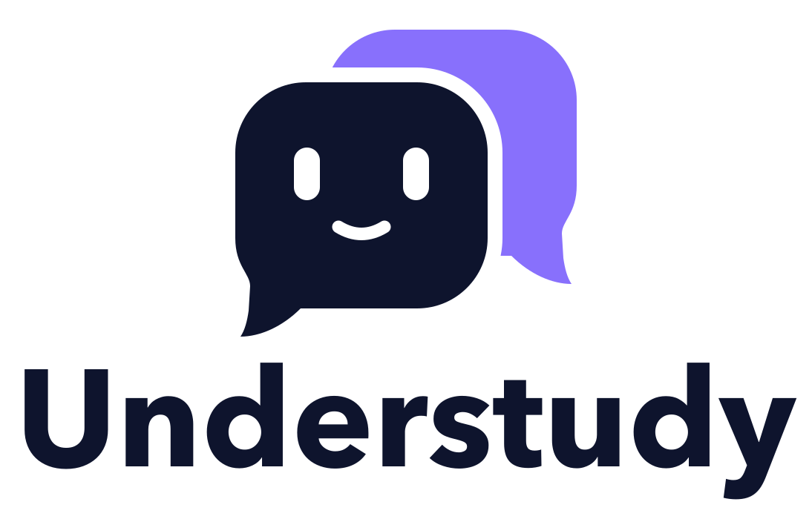

<p align="center">
  <picture>
    <source media="(prefers-color-scheme: dark)" srcset="assets/logo-dark.svg">
    
  </picture>
</p>

# Understudy

Ask a coworker's Claude a question from Slack. An understudy stands in when the lead is
busy: each participating coworker runs a small daemon on their dev machine; questions
from Slack spin up a **read-only Claude Code session** (Claude Agent SDK) scoped to
directories they chose to expose, and the answer streams back into the Slack thread.
Access is invitation-only, revocable in one click, and every conversation is audited.

```
Slack ──Socket Mode──► Broker ◄──WSS (daemon dials out)── Daemon ──spawns──► read-only Claude Code
                        │ ACLs · audit log · dashboard          │ path allowlist · secret deny-list
                        │ routes agent-to-agent questions       │ can ask other daemons' agents (via broker)
```

Everything connects **outbound**: nobody opens a port on their laptop. Agents never talk
to each other directly either: a question from one agent to another is just another
brokered query, checked against the original asker's access.

## Components

| Package | Runs on | What it does |
|---|---|---|
| `packages/broker` | a small server (Fly.io, VPS, or your machine to start) | Slack app (Socket Mode), WebSocket hub for daemons, enrollment + revocation, ACLs, rate limits/budgets, audit log, admin dashboard at `/admin` |
| `packages/app` | each coworker's Mac (recommended) | Menu-bar app wrapping the daemon: one-click `understudy://` enrollment links, native folder picker, pause/resume, model picker, recent questions, start-at-login, unenroll — no terminal needed. Ships the Claude Code runtime; the owner just needs to be signed in. |
| `packages/daemon` | each coworker's machine (CLI alternative) | Outbound WSS connection, spawns read-only Agent SDK sessions, path containment, secret redaction, local audit log, desktop notifications, pause/unenroll kill switch, one `ask_agent` tool for consulting other coworkers' agents |
| `packages/shared` | both | Wire protocol (zod), path containment rules, secret redaction |

## Setup

### 1. Create the Slack app

1. Go to [api.slack.com/apps](https://api.slack.com/apps) → **Create New App** → *From an app manifest* → paste `slack-app-manifest.yaml`.
2. **Basic Information → App-Level Tokens**: create a token with scope `connections:write` → this is `SLACK_APP_TOKEN` (xapp-…).
3. **Install App** to your workspace → **Bot User OAuth Token** is `SLACK_BOT_TOKEN` (xoxb-…).

### 2. Run the broker

```sh
pnpm install
cp .env.example .env        # fill in tokens, ADMIN_TOKEN, your Slack user ID
set -a; source .env; set +a
pnpm broker
```

The dashboard is at `http://localhost:8787/admin` (user `admin`, password = `ADMIN_TOKEN`).
For real use, put the broker somewhere daemons can reach over HTTPS/WSS (Fly.io,
Railway, a VPS behind Caddy). Only the daemons and the dashboard need to reach it —
Slack does not (Socket Mode dials out). [docs/DEPLOYING.md](docs/DEPLOYING.md) has
the systemd recipe and the pull-and-restart update procedure.

### 3. Build the Mac app (once)

```sh
pnpm app dist:unsigned                             # → packages/app/release/Understudy-<v>-arm64.dmg
cp packages/app/release/Understudy-*.dmg packages/broker/downloads/
```

The broker now serves the installer at `/downloads/…` and links it from every token page.

`dist:unsigned` skips code signing, so that DMG runs on your machine but is
Gatekeeper-blocked on anyone else's. For a build you hand to a coworker, use the
signed and notarized DMG that CI publishes to
[Releases](https://github.com/austinulfers/workspace-agent/releases) on every
version bump — see [docs/RELEASING.md](docs/RELEASING.md).

### 4. Enroll a coworker (no terminal involved)

1. Dashboard → **Enroll a new coworker** → host name (`jane`) + their Slack user ID.
2. The token page gives you a download link and a one-click `understudy://enroll?…`
   link — send both to them privately.
3. They install the app, click the link, pick which folders to share in a native
   dialog (their `~/.claude` folder is preselected), and hit **Enroll This Mac**.
   The app lives in the menu bar, starts at login, keeps itself updated from
   Releases, and answers begin flowing. Sessions run on **their** Claude sign-in
   (the app detects it and points them at claude.com/claude-code if missing).
4. Access is theirs to give: the new owner DMs the bot `allow @coworker` (or uses the
   app's **People** tab) to choose who may ask their agent. The owner is allowed
   automatically; IDs in `ADMIN_SLACK_IDS` bypass ACLs; your dashboard can still
   add/remove anyone as an override.

CLI alternative (any platform): `pnpm daemon enroll --broker <url> --token <T> --root ~/code/repo && pnpm daemon start`.

### 5. Ask things

- **Channel:** `/ask jane where does token refresh happen?` — the bot posts the question, answers in the thread, and thread replies continue the same session. (`/invite @Understudy` to the channel first.)
- **Mention:** `@Understudy jane: what runs on deploy?`
- **DM the bot:** `jane: where is the retry logic?` — after that, just keep typing; the DM stays pointed at jane until you name another host or say `reset`. `hosts` lists agents you can reach and the folders each one shares, `help` explains all of this.

If a host is offline, asleep, or paused, the bot says so immediately.

### 6. Agents consult each other

The agent you ask knows which *other* agents you can reach and which folders each one
shares (the same list `hosts` shows you). When the answer probably lives on a coworker's
machine — the other side of an API this code calls, a service this repo depends on,
something it searched for here and couldn't find — it can ask that agent a specific
question, fold the answer into its own, and say so:

> … the token is minted in `auth/session.ts:41` and checked on bob's side in
> `middleware/verify.ts`, per bob's agent.
>
> _🤝 Consulted bob's agent._

- **Your access, not the host's.** A consultation is checked against *your* ACLs, the
  consulted host's budget, and its presence — exactly as if you had `/ask`ed it yourself.
  An agent can only reach agents you could ask directly, so a hop never exposes code you
  weren't granted.
- **One hop, a few questions.** A consulted agent can't consult onward. One answer may ask
  at most `PEER_ASKS_PER_QUERY` questions (default 3), each capped at
  `PEER_QUERY_TIMEOUT_MS` (default 3 minutes); ending or cancelling the question ends
  its consultations too.
- **Costs land where the work runs.** Each consultation counts against the consulted
  host's daily budget, since it runs on their Claude account. It doesn't count against
  your per-minute rate limit; the per-question cap bounds it instead.
- **Nothing is hidden.** The consulted owner gets the usual notification (“austin's agent
  is asking your agent a question for Jane”), the exchange shows up in both owners'
  **Conversations** and in the local activity log, and the Slack answer names every agent
  it consulted.
- **Owners can opt out.** The app's **Settings** tab has *Let other agents ask my agent
  questions*, on by default. Switched off, other agents still know your agent exists and
  will tell the asker to `/ask` you directly.

Follow-ups reuse the consultation: if the agent asks bob's agent again in the same thread,
bob's session resumes, so it remembers what it already said. Set `PEER_ASKS_PER_QUERY=0`
on the broker to turn consultations off; agents still know who else exists and will
suggest `/ask <name>` instead.

## Host-owner controls

Everything is in the menu-bar app. The tray menu has pause/resume, shared folders,
**Answer Model**, recent questions, start at login, and **Unenroll This Mac**.
**Open Understudy…** opens the owner panel:

- **People** — who may ask your agent: search coworkers by name, add/remove.
  Same power from your DM with the bot: `allow @name`, `deny @name`, `team`.
  Grantees get a courtesy DM explaining how to ask (needs the `im:write` scope —
  re-install the Slack app after updating the manifest).
- **Conversations** — every conversation that ran on your machine, with full
  transcripts.
- **Settings** — questions run on *your* Claude account, so the daily cap is yours:
  team default or a custom number, plus today's usage. Also whether coworkers' agents
  may put questions to yours (on by default; see below), and the **Instructions**
  your agent starts every answer with.

**Answer Model** picks which Claude model answers coworkers' questions — Claude
Code's default, Opus 5, Sonnet 5, or Haiku 4.5. Since the questions bill to your
account, this is the cost/quality dial next to the daily cap: Haiku for a cheap
agent that mostly points people at files, Opus for one that reasons across a
codebase. It takes effect on the next question; in-flight answers finish on the
model they started with, and a follow-up in an existing Slack thread switches
that conversation over too.

**Instructions** is the prompt your agent is given before every answer. The default
asks for a direct, cited answer in Slack-sized prose and no guessing; edit it in the
Settings tab to change the tone, what to cite, or where to look first, and **Reset to
default** brings the stock text back. Understudy appends what the agent should know
about other coworkers' agents, so that part isn't yours to edit. Nothing in the prompt
can loosen the sandbox: the read-only tool set, root containment, and secret redaction
are enforced in code. Like the model, it takes effect on the next question, follow-ups
included, and it lives in `~/.understudy/config.json`, not on the broker.

The CLI offers the daemon basics too:

```sh
pnpm daemon pause      # refuse queries until resume (picked up within 5s while running)
pnpm daemon resume
pnpm daemon roots list|add <dir>|remove <dir>
pnpm daemon model list|set <model>|default   # `set` takes any id Claude Code accepts
pnpm daemon prompt show|set <file>|default   # the agent's instructions; `set -` reads stdin
pnpm daemon status
pnpm daemon unenroll   # revoke this machine and delete local credentials
```

Every query fires a macOS notification, and a local JSONL mirror of all activity is
kept in `~/.understudy/logs/` — the owner never has to trust the broker's log alone.

## Security model

- **Read-only, twice over.** Sessions get only `Read`/`Grep`/`Glob`, and a `PreToolUse`
  hook independently vets every call (including reads inside the working directory,
  which Claude Code would otherwise approve on its own): paths are resolved, symlinks
  followed, and must land inside an exposed root without matching the secret deny-list
  (`.env*`, key files, `.ssh/`, `.aws/`, …). Search tools scan whole
  directories, so a `PostToolUse` hook strips any result line that came from a protected
  file before the model sees it. No Bash, no writes, no web access, no MCP servers from
  the owner's own setup, and guest sessions never load the owner's `CLAUDE.md`/settings.
  None of it hinges on the prompt, so an owner rewriting their agent's instructions
  cannot loosen it.
- **Redaction on both ends.** Credential-shaped strings (PEM blocks, `sk-…`, `AKIA…`,
  `xoxb-…`, JWTs, `password=…`) are scrubbed on the daemon before the answer leaves the
  machine, and again on the broker before posting to Slack.
- **Default-deny access, owner-granted.** Nobody can query a host until its owner
  grants them access (`allow @name` in Slack or the app's People tab); admins bypass
  and can override from the dashboard, and every grant records who made it.
  Revoking a host severs its socket immediately and refuses reconnects.
- **Budgets.** Per-asker rate limit (6/min) and per-host daily query cap (50 by default) —
  queries run on the host's Claude plan.
- **Agent hops inherit the asker's access.** When one agent consults another, the broker
  applies the *asker's* ACL and the consulted host's budget, never the asking host owner's
  access. Hops go one level deep, a few per question, and the consulted agent is told
  who is asking and on whose behalf.
- **Honest boundary:** read-only is not "safe" — anyone with query access can read any
  exposed source through the agent. Grant access like you'd grant repo access.

## Development

```sh
pnpm typecheck        # all packages
pnpm broker           # run broker (needs env)
pnpm daemon <cmd>     # daemon CLI
```
